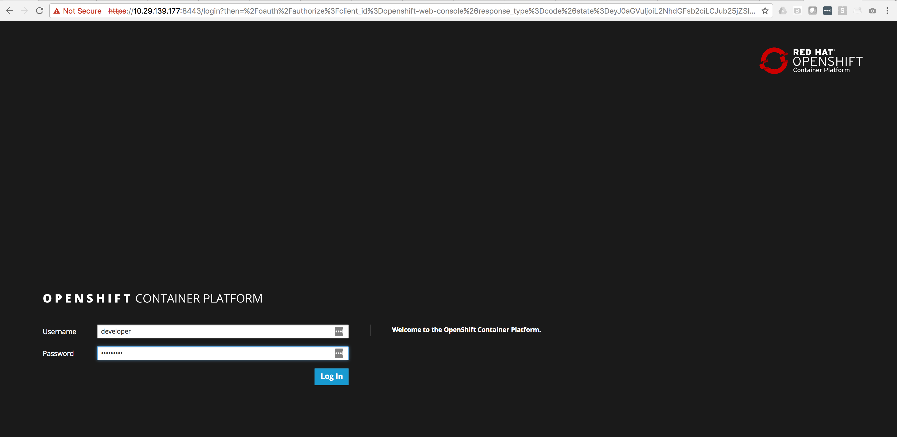
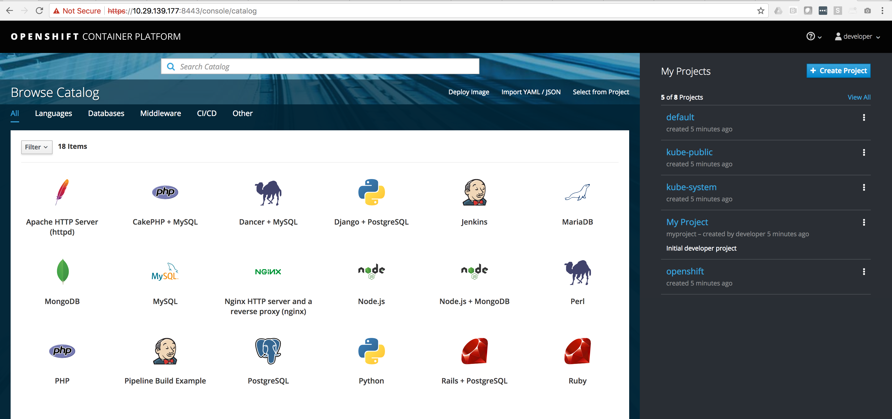

# How to deploy OpenShift on Fedora 27 (oc cluster up)

First thing we need to do is get Docker up and running and configured on Fedora

* This will get docker installed: 
  ```
  [phil@c3po ~]$ sudo dnf install docker -y
  ```
* Configure the Docker daemon with an insecure registry of `172.30.0.0/16`
   - In Fedora, edit the `/etc/containers/registries.conf` file and add the following lines:
     ```
     [registries.insecure]
     registries = ['172.30.0.0/16']
     ```

* After editing the config, restart the Docker.
     ```
     $ sudo systemctl restart docker
     ```

* It's handy if you regular user is a part of the Docker group so you don't need to be root to run Docker commands
    ```
    sudo usermod -a -G docker username
    ```

*  Ensure that your firewall allows containers access to the OpenShift master API (8443/tcp) and DNS (53/udp) endpoints.
   In Fedora, you can create a new firewalld zone to enable this access:
   - Determine the Docker bridge network container subnet:
     ```
     docker network inspect -f "{{range .IPAM.Config }}{{ .Subnet }}{{end}}" bridge
     ```
     You should get a subnet like: ```172.17.0.0/16```

   - Create a new firewalld zone for the subnet and grant it access to the API and DNS ports:
     ```
     firewall-cmd --permanent --new-zone dockerc
     firewall-cmd --permanent --zone dockerc --add-source 172.17.0.0/16
     firewall-cmd --permanent --zone dockerc --add-port 8443/tcp
     firewall-cmd --permanent --zone dockerc --add-port 53/udp
     firewall-cmd --permanent --zone dockerc --add-port 8053/udp
     firewall-cmd --reload
     ```

*  Download the Linux `oc` binary from
   [openshift-origin-client-tools-VERSION-linux-64bit.tar.gz](https://github.com/openshift/origin/releases)
   and place it in your path.

* We're going to bring OpenShfit up not on your local "127.0.0.1" adress

Let's find you local IP Address, in my case my ip address is "10.29.139.177"

    ifconfig | grep inet
    	inet 127.0.0.1 netmask 0xff000000
    	inet6 ::1 prefixlen 128
    	inet6 fe80::1%lo0 prefixlen 64 scopeid 0x1
    	inet6 fe80::1806:9e8a:ec4c:716f%en0 prefixlen 64 secured scopeid 0x4
    	inet 10.29.139.177 netmask 0xff000000 broadcast 10.255.255.255
    	inet6 fe80::407c:74ff:feae:e421%awdl0 prefixlen 64 scopeid 0x9
    	inet6 fe80::5d47:1187:e0f:97e0%utun0 prefixlen 64 scopeid 0xa

Run this command to start up OpenShift "

    oc cluster up --public-hostname 10.29.139.177

    Using Docker shared volumes for OpenShift volumes
    Using public hostname IP 10.29.139.177 as the host IP
    Using 10.29.139.177 as the server IP
    Starting OpenShift using registry.access.redhat.com/openshift3/ose:v3.9.14 ...
    OpenShift server started.

You will get some information to connect to your cluster:

    Using Docker shared volumes for OpenShift volumes
    Using public hostname IP 10.29.139.177 as the host IP
    Using 10.29.139.177 as the server IP
    Starting OpenShift using registry.access.redhat.com/openshift3/ose:v3.9.14 ...
    OpenShift server started.

    The server is accessible via web console at:
        https://10.29.139.177:8443

    You are logged in as:
        User:     developer
        Password: <any value>

    To login as administrator:
        oc login -u system:admin

Go ahead and make sure you can login to your cluster"

    oc login -u system:admin

    Logged into "https://10.29.139.177:8443" as "system:admin" using existing credentials.

    You have access to the following projects and can switch between them with 'oc project <projectname>':

        default
        kube-public
        kube-system
      * myproject
        openshift
        openshift-infra
        openshift-node
        openshift-web-console

    Using project "myproject".

Let's elevate the "developer" account to be a cluster admin

    oc adm policy add-cluster-role-to-user cluster-admin developer

    cluster role "cluster-admin" added: "developer"

Open up your browser and make sure you can login into the OpenShift WebUI





Ok you are up and running with "oc cluster up" - Have fun...

tester 
tester