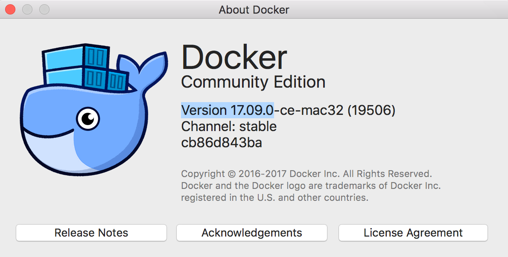
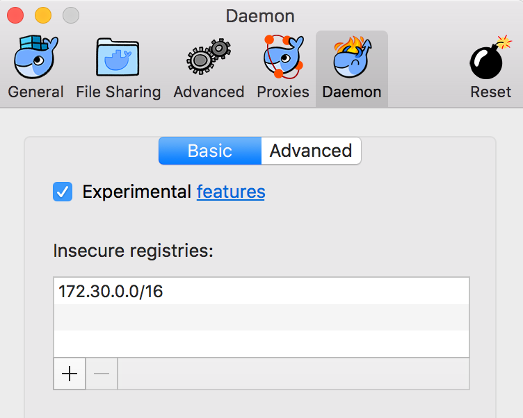
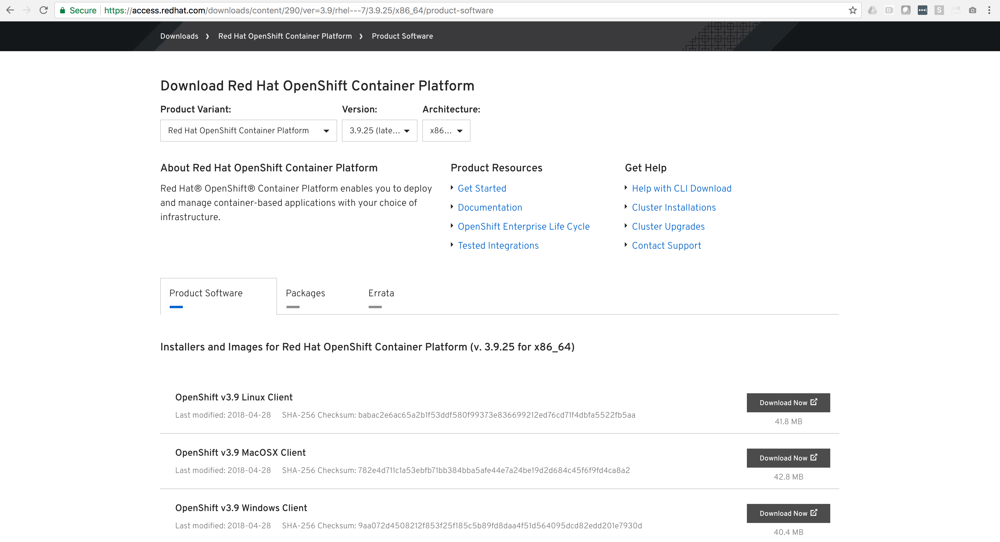
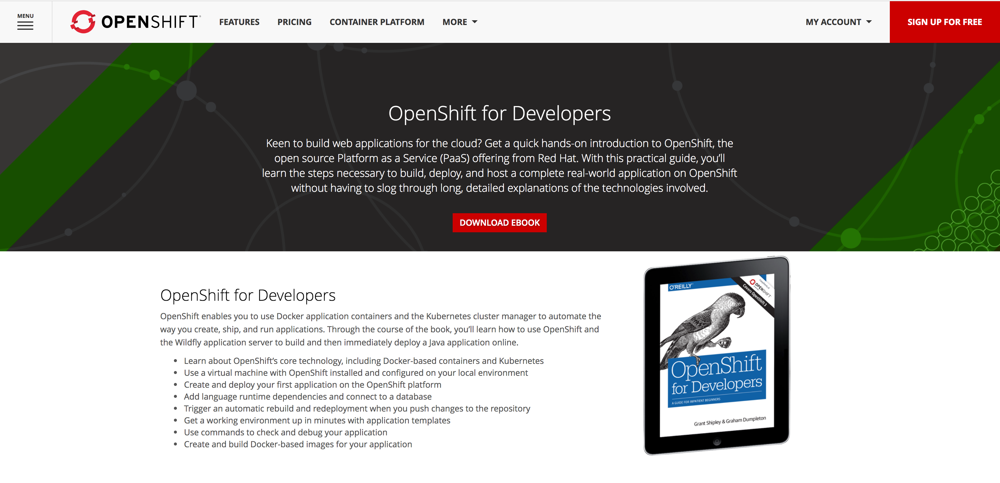
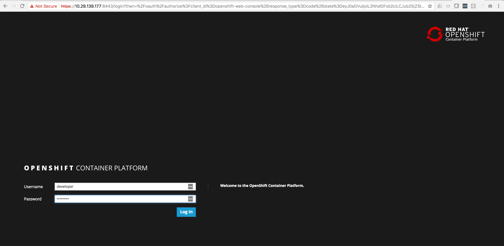
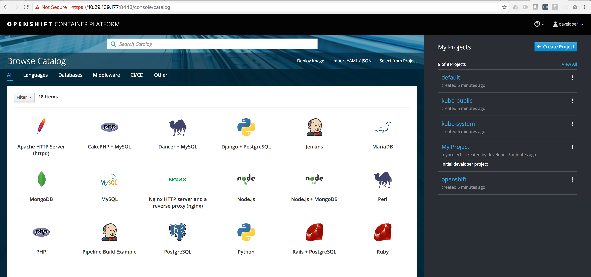

# How to deploy OpenShift on Mac (oc cluster up)

First thing we need is to get Docker up and running on your Mac

Grab the required files here: [https://download.docker.com/mac/stable/21698/Docker.dmg](https://download.docker.com/mac/stable/21698/Docker.dmg)

*** WARNING - Newer version of docker has some bugs.

*** We recommend not going above version - Version 17.09.0

You are going to have to add this IP Range to "Insecure Registries"

Next thing we need is the "OC Client Tools" - You can grab them from Red Hat here:

Documentation explaining how to get things up and running are also available on this site

If you don't have an account you can create a free developer here:

[https://www.openshift.com/promotions/for-developers.html](https://www.openshift.com/promotions/for-developers.html)

After you download the "oc binary" - find you path

    echo $PATH
    /usr/local/bin:/usr/bin:/bin:/usr/sbin:/sbin

Copy the "oc binary" into you local path (from the dir "oc" is downloaded

    cp oc /usr/local/bin

We are going to avoid bring OpenShift up on "127.0.0.1"

Let's fine you local IP Address, in my case my ip address is "10.29.139.177"

    ifconfig | grep inet
    	inet 127.0.0.1 netmask 0xff000000
    	inet6 ::1 prefixlen 128
    	inet6 fe80::1%lo0 prefixlen 64 scopeid 0x1
    	inet6 fe80::1806:9e8a:ec4c:716f%en0 prefixlen 64 secured scopeid 0x4
    	inet 10.29.139.177 netmask 0xff000000 broadcast 10.255.255.255
    	inet6 fe80::407c:74ff:feae:e421%awdl0 prefixlen 64 scopeid 0x9
    	inet6 fe80::5d47:1187:e0f:97e0%utun0 prefixlen 64 scopeid 0xa

You may need to authenticate with the Red Hat Registry using your existing partner/customer credentials:

    docker login registry.redhat.io

Run this command to start up OpenShift "

    oc cluster up --public-hostname 10.29.139.177

    Using Docker shared volumes for OpenShift volumes
    Using public hostname IP 10.29.139.177 as the host IP
    Using 10.29.139.177 as the server IP
    Starting OpenShift using registry.access.redhat.com/openshift3/ose:v3.9.14 ...
    OpenShift server started.

You will get some information to connect to your cluster:

    Using Docker shared volumes for OpenShift volumes
    Using public hostname IP 10.29.139.177 as the host IP
    Using 10.29.139.177 as the server IP
    Starting OpenShift using registry.access.redhat.com/openshift3/ose:v3.9.14 ...
    OpenShift server started.

    The server is accessible via web console at:
        https://10.29.139.177:8443

    You are logged in as:
        User:     developer
        Password: <any value>

    To login as administrator:
        oc login -u system:admin

Go ahead and make sure you can login to your cluster"

    oc login -u system:admin

    Logged into "https://10.29.139.177:8443" as "system:admin" using existing credentials.

    You have access to the following projects and can switch between them with 'oc project <projectname>':

        default
        kube-public
        kube-system
      * myproject
        openshift
        openshift-infra
        openshift-node
        openshift-web-console

    Using project "myproject".

Let's elevate the "developer" account to be a cluster admin

    oc adm policy add-cluster-role-to-user cluster-admin developer

    cluster role "cluster-admin" added: "developer"

Open up your browser and make sure you can login into the OpenShift WebUI

Ok you are up and running with "oc cluster up" - Have fun...
